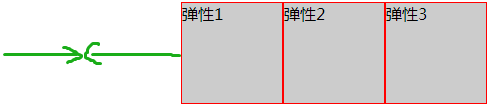

# 麻将馆预约小程序

## 1.服务平台

扫码加微信（微信ID：**winston88489790**），备注mahjong，秒级回复各种项目运行以及配置环境中出现的bug。


扫码关注公众号，持续推送新的开源保姆级项目。


## 2.项目介绍

前置知识：学过vue，springboot开发，Redis和MySQL

Hi雀神是一个前后端分离的麻将馆预约微信小程序，项目采用 SpringBoot+uniapp 开发，项目加入常见的企业级应用所涉及到的技术点，例如 Redis、MySQL，Caffeine，quartz定时任务等。

前期后端只需要小伙伴安装MySQL和Redis中间件就可以启动项目，以便小伙伴快速看到效果，迅速看到效果是继续学习编程的自信，后期会有更多技术引入，期待学完之后的反馈从而因地制宜的引入新技术。

### 2.1 项目技术栈

#### 2.1.1 后端技术栈

项目地址：https://github.com/winston-One/MahjongMaster

1. Spring Boot
2.  MyBatis
3. MyBatis-Plus
4. MySQL
5. Redis
6. Caffeine
6. Scheduled 
7. 各种SDK
7. 满足DDD领域驱动开发
9. ...

#### 2.1.2 前端技术栈

项目地址：https://github.com/winston-One/MahjongFrontEnd

1. uniapp
2. uview
3. Vue
8. ...

### 2.2 项目效果图


### 2.3 后期发展

**star量超过100的话，后期会整合rabbitMQ中间件实现店铺自动营业和休息，**

使用mongodb记录一些大数据量的用户评论数据和订单数据

使用websock实现即时通讯评论

我们将不再拘泥于一家麻将馆，可能会引入全国各地麻将馆，甚至是棋馆，用户想快速搜索出所需要店家，引入搜索引擎ElasticSearch

整个quartz做定时任务，定时清理Redis中未支付的订单数据

后期还会整合springboot开发技巧，例如使用AOP自定义注解解决业务问题

后期还会进行接口安全性配置

整合实现接口幂等性

整合使用设计模式优化小目录代码

整合规则引擎drools，将业务规则从代码中分离出来，使用单独的`.drl`文件写if-else规则.

## 3.快速部署

### 3.1 安装开发环境

#### 3.1.1 小程序

开发需要安装两个软件：

- uniapp开发使用HBuilderX

- 微信小程序运行使用微信开发者工具：
- 注册小程序，获取appid

##### HBuilderX

uniapp官方文档：https://uniapp.dcloud.net.cn，在开发中查看一些API和组件用法

下载 HBuilder https://www.dcloud.io/hbuilderx.html  ---> 点击首页的download ----->选择正式版的APP开发版。

安装  

1. 下载下来之后是一个zip包
2. 将压缩包存放到纯英文的目录中进行解压
3. 双击HBuilderX.exe 即可启动hbuilder

将微信开发者工具配置到HBuilderX中

> 安装 scss/sass 编译

为了方便编写样式（例如：`<style lang="scss"></style>`），建议安装 `scss/sass 编译` 插件。插件下载地址：https://ext.dcloud.net.cn/plugin?name=compile-node-sass


> 配置运行环境


> 运行小程序


##### 微信开发者工具

下载地址：https://developers.weixin.qq.com/miniprogram/dev/devtools/stable.html


下载完成之后直接傻瓜式安装即可。

> 开启服务端口


>避免不合法域名的网络请求错误


##### 注册小程序

appid是你当前小程序的唯一标识，uniapp项目中的manifest.json需要配置好appid，

https://mp.weixin.qq.com/

立即注册--->填写相关信息--->邮箱激活---->选择个人 然后身份证然后扫码注册即可。

查看登录官网https://mp.weixin.qq.com/之后的appid


>开通微信认证

开通微信认证之后才能使用微信支付功能和获取手机号以及地图等等功能，微信认证每年费用是300元，可以不交，后续也会讲到模拟支付功能。但是开通微信认证的小程序注册之前不能是个人户，要以企业为主体。


>在manifest.json配置appid


>基础配置


> 配置支付


#### 3.1.2 后端

可以在公众号软件管家中通过百度网盘安装企业版的开发环境

java使用jdk8，IntelliJ IDEA作为集成开发环境。

springboot框架环境使用2.3.12.RELEASE版本。

数据库可视化界面使用SQLyog

Redis可视化界面使用Another Redis Desktop Manager

mongodb可视化界面使用MongoDBCompass

### 3.2 搭建环境

#### 3.2.1 后端Running

1. clone 项目到本地 `https://github.com/winston-One/MahjongMaster`
2. 数据库脚本使用 sqlyog或者Navicat进行可视化查看，**需要手动导入数据库脚本**，该sql脚本中包含了初始数据和表结构，安转完mysql创建好数据库之后，就可以直接执行。只需要提前在本地 MySQL 中创建一个空的数据库queshen，并修改项目中关于数据库的配置（resources 目录下的 application-dev.yaml 文件中）即可
3. 提前准备好 Redis，在 项目的 application.properties 文件中，将 Redis 配置改为自己的

由于项目中使用了Redis和MySQL，所以这两个中间件是不可少的。后期拓展其他的技术栈的使用再慢慢进行安装跟进。

#### 3.2.2 微信小程序Running

```shell
# 安装依赖
npm install
# 在HBuilderX中打开项目，在微信开发者工具中运行项目
```

在` MahjongFrontEnd` 项目中已经配置了端口转发，将数据转发到 Spring Boot 上，因此在HBuilderX打开该项目，在微信开发者工具 运行，就可以访问微信小程序了，所有的请求通过http协议转发将数据传到MahjongMaster本地项目 中（注意此时要一直Running该 Sprin gBoot 项目）。

微信小程序不需要[使用 Nginx 部署前后端分离项目，解决跨域问题](https://mp.weixin.qq.com/s/C7PIck3SIPPTcA3NX3ELoQ)）。

```shell
# maven下载拓展包，美团的验券sdk和微信支付sdk
mvn install:install-file -Dfile=F:\Hi雀神\dianping-openapi-java-sdk-qa-1.0.0.jar -DgroupId=com.dianping -DartifactId=dianping-openapi-java-sdk-qa -Dversion=1.0.0 -Dpackaging=jar -Dmaven.repo.local=C:\Users\Acer\.m2\repository
```


## 4. 文档


## 5.微信小程序前端

### 5.1 小程序项目结构

#### 1. 整体项目结构


#### 2. 小程序分包目录结构


#### 3. 全局自定义组件


#### 4. uniapp提供的扩展组件库

需要先下载然后将下载好的组件包放到uni_modules中，也可以在组件包中修改里面的样式，达到自己需要的效果。


下载：https://ext.dcloud.net.cn/plugin

#### 5. page文件夹

底部tabbar页面，四个包说明有四个tabbar页面，一个页面为一个vue文件。


### 5.2 小程序启动流程

首先小程序先main.js加载，main.js中首次加载第一个vue组件——APP.vue，继而根据App.vue中的onLoad方法可以知道小程序最终一开始先展示哪个tabbar页面。

App.vue作为全局组件，所以可以在App.vue中配置全局公共方法和公共参数globalData，全局的参数和方法可以通过**getApp()**进行调用。

在`App.vue`中，可以定义一些全局通用样式，

小程序中不使用路由，直接使用页面跳转uni.navigateTo({url: 'url?id=1&name=uniapp'});，具体参看[uni.navigateTo(OBJECT) | uni-app官网 (dcloud.net.cn)](https://uniapp.dcloud.net.cn/api/router.html#navigateto)，跳转页面也可以传递参数，传递数组参数需要编码压缩。跳转的目标页面在onLoad(option)方法中能接收参数，option就是传递过来的所有参数的对象。

### 5.3 小程序布局

小程序布局使用流式布局。

#####  display： flex 

让块级子元素居中，直接给父级元素使用flex，避免了使用浮动和定位这种复杂的css，子元素的float、clear和vertical-align属性将失效。弹性布局。

##### flex的六大属性

###### flex-direction

1： flex-direction: row; 沿水平主轴让元素从左向右排列


2： flex-direction: column; 让元素沿垂直主轴从上到下垂直排列


3： flex-direction: row-reverse;沿水平主轴让元素从右向左排列


###### flex-wrap 

容器内元素的换行(默认不换行)
1： flex-wrap:  nowrap; (默认)元素不换行,比如：一个div宽度100%，设置此属性，2个div宽度就自动变成各50%；
2： flex-wrap:  wrap; 元素换行,比如：一个div宽度100%，设置此属性，第二个div就在第二行了；

###### justify-content

1： justify-content : center;元素在主轴（页面）上居中排列

2： justify-content : flex-start;元素在主轴（页面）上由左或者上开始排列


3： justify-content : flex-end;元素在主轴（页面）上由右或者下开始排列

4： justify-content : space-between;元素在主轴（页面）上左右两端或者上下两端开始排列


5： justify-content : space-around;每个元素两侧的间隔相等。所以，元素之间的间隔比元素与边框的间隔大一倍。


Flex布局以后，子元素的float、clear和vertical-align属性将失效。
justify-content：水平排列
align-content:垂直排列
align-items 水平居中基准线
flex可以用于块级元素，也可用于行内元素

###### align-items 

元素在主轴（页面）当前行的横轴（纵轴）方向上的对齐方式
1： align-items : flex-start; 弹性盒子元素的侧轴（纵轴）起始位置的边界紧靠住该行的侧轴起始边界（靠上对齐）。


2： align-items : flex-end; 弹性盒子元素的侧轴（纵轴）起始位置的边界紧靠住该行的侧轴结束边界。（靠下对齐）


3： align-items : center; 弹性盒子元素在该行的侧轴（纵轴）上居中放置。（居中对齐）

4： align-items : baseline; 如弹性盒子元素的行内轴与侧轴为同一条，则该值与’flex-start’等效。其它情况下，该值将参与基线对齐。（靠上对齐)

###### align-content 

在弹性容器内的元素没有占用交叉轴上所有可用的空间时，对齐容器内的各项（垂直）

1： align-content: flex-start; 元素位于容器的开头。各行向弹性盒容器的起始位置堆叠。


2: align-content: flex-end; 元素位于容器的结尾。各行向弹性盒容器的结尾位置堆叠。


3: align-content: stretch; 元素位于容器的中心。各行向弹性盒容器的中间位置堆叠。


4: align-content: center; 默认值。元素被拉伸以适应容器。各行将会伸展以占用剩余的空间。如果剩余的空间是负数，该值等效于’flex-start’。


5: align-content: space-between;元素位于各行之间留有空白的容器内。各行在弹性盒容器中平均分布。


6: align-content: space-around;元素位于各行之前、之间、之后都留有空白的容器内。各行在弹性盒容器中平均分布，两端保留子元素与子元素之间间距大小的一半。如果剩余的空间是负数或弹性盒容器中只有一行，该值等效于’center’。


#### 小程序事件

```js
@click 组件被点击  
@longpress 长按（手指触摸超过350ms）  (微信小程序和H5)
@longtap 长按  （支付宝小程序等）
@tap 点击  
@touchcancel 手指触摸被打断，如来电提醒，弹窗  
@touchend 手指触摸动作结束，如松开按钮  
@touchmove 手指触摸后移动  
@touchstart 手指触摸动作开始
```

### 5.4 骨架屏

骨架屏就是可以在进入页面时，后端数据尚未加载完成之后，先显示灰色阴影部分，增加用户体验，可以在微信开发者工具生成

在未请求到数据之前，不会让页面显示出undefined或者空白页面，skeleton.vue页面。

工具可以为**当前正在预览的页面**生成骨架屏代码。工具入口位于模拟器面板右下角三点处。


点击生成骨架屏，将有弹窗提示是否允许插入骨架屏代码。确定后将在当前页面同级目录下生成 `page.skeleton.wxml` 和 `page.skeleton.wxss` 两个文件，分别为骨架屏代码的模板和样式。

将生成的wxml和wxss复制到uniapp项目中骨架屏vue组件中，并且需要删除html代码中所有的is属性和data-event-opts属性之后才能使用


> 使用

首先将骨架屏放到小程序分包的components包中。

然后在小程序分包中指定页面中先引入并且注册才能使用。


一般通过v-if进行展示是展示数据组件还是展示骨架屏，对于一些静态组价可以不生成骨架屏（在生成的骨架屏html页面中自行删除即可，需要测试，避免删除错漏），


## 6.小程序后端

### 6.1 启动后端服务

安装MySQL8.x版本，安装Redis5.x，


### 6.2 微信小程序登录

小程序的登录不能直接调用后端接口，需要先进行一系列的处理。

**后台 api 接口收到 code 后，调用微信接口 jscode2session ， 换取 openid 、 session_key 、 unionid**

小程序端调用 wx.login() 方法，获取 code 后，将 code 通过后台 api 接口传递到后台。

这里有三个知识点必须十分清楚：

1）unionid : 同一用户 ，在同一开发平台下，多个应用 unionid 相同 。 不同应用下 openid 是不同的 ， 若需要打通多个应用的用户体系 ， unionid 是唯一的做法。

2） session_key : 为应用安全，session_key 不应该直接传递到小程序端 ， 正确的做法是将 session_key 存储在[服务器](https://cloud.tencent.com/product/cvm?from=10680)端 。

session_key 存储方式这里以 redis 为例进行讲解，调用 jscode2session 接口返回的数据有 openid 和 session_key ， openid 是唯一的 ， 因此 redis 存储的 key 可以为 openid 的 MD5 加密字符串 ， value 为 session_key ， 有效期可设置为 10 min（你认为的合适的有效期） ， openid 的加密字符串作为 userToken 返回给小程序 ， 这样我们在使用的时候 ， 就可以通过 userToken 来换取 session_key 。

3）session_key 有效期：微信平台不会告诉我们 session_key 准确的有效期 ， 会有过期的情况出现 ， 如何验证 session_key 的有效性呢 ？ 在小程序端可以使用 wx.checkSession() 方法来验证 session_key 有效性 ，若 session_key 失效 ，则需要重新执行 wx.login() 方法 ， 也就是从第一步开始重新执行 。

小程序端提交 code 调用后台 api 接口后 ， 获取 api 接口返回的 userToken ，通过页面 button 点击调用后台接口 ， 传递参数 userToken 、 iv 、 encryptedData 到后台进行数据解密，得到 phoneNumber

**总结：**

1） 解密 encryptedData 数据十分重要 ， 我第一次做 encryptedData 解密的时候花了不少时间。

2） session_key 的正确处理方式是服务器保存 ， 将可以获取 session_key 的钥匙传递给小程序端 ， 防止出现安全问题 。

3） 小程序端发起获取用户手机号操作，必须使用 button 并设置 open-type="getPhoneNumber" ，并从 button 的绑定事件中获取所需信息 

### 6.3 美团验券

可以对照官网学会对美团第三方接口的使用[美团 - 北极星开放平台 (dianping.com)][](https://open.dianping.com/)

或者阅读项目中的代码，配合作者的注释，也可以添加本人微信进行沟通秒回解答。

### 6.4 小程序下单支付

[开通微信支付][](https://blog.csdn.net/weixin_45932157/article/details/109748886?spm=1001.2014.3001.5506)

[微信小程序注册以及认证流程][(149条消息) 【Wechat】微信小程序注册以及认证流程_小程序注册流程_java_leaf@qq.com的博客-CSDN博客](https://blog.csdn.net/cc874944236/article/details/108900814?spm=1001.2014.3001.5506)


### 6.5 评论系统

待开发

### 6.6 websocket即时通讯

待开发

## 7. 其他资料

关注公众号**全栈大学堂**，专注于 开源保姆级项目贡献，定期视频教程分享，关注后实时推送新的开源项目


